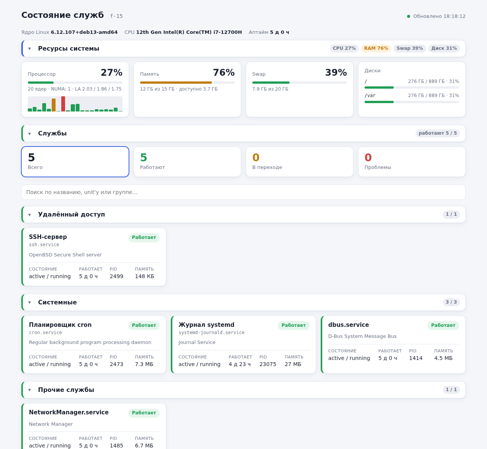

# service-monitor



**service-monitor** — HTTP-сервер, который показывает в браузере состояние служб systemd и ресурсы системы.
Список служб задаётся в JSON-конфигурации, службы можно объединять в группы. Состояние служб запрашивается
у systemd через D-Bus, метрики системы читаются из `/proc` и `/sys`. Права root не нужны.

## Возможности

- Состояние каждой службы: `ActiveState`/`SubState`, время работы, PID, память, число автоматических перезапусков,
  ошибки (unit не найден, неверное имя и т.п.).
- Итоговая оценка службы: **работает**, **переход** (запуск, остановка, перезагрузка), **не работает**, **неизвестно**.
- Группировка служб в конфигурации, сворачиваемые секции групп со сводкой по каждой.
- Сводка по всем службам с фильтром по состоянию и поиском по названию, unit'у или группе.
- Ресурсы системы: загрузка процессора (общая и по ядрам), load average, память, swap, hugepages, NUMA-узлы,
  заполненность дисков. Версия ядра, модель процессора и аптайм.
- Автообновление страницы, светлая и тёмная тема, адаптивная вёрстка.
- JSON API `/api/status` с теми же данными.
- Изменения состояния служб пишутся в syslog.

## Требования

### Для сборки

- CMake 3.25+
- компилятор с поддержкой C++20 (GCC 12+)
- `fmt`
- `nlohmann-json`
- `sdbus-c++` 2.x
- `googletest` — только для тестов

[cpp-httplib](https://github.com/yhirose/cpp-httplib) v0.18.7 встроен в проект (`third_party/httplib`) и используется
в header-only режиме, отдельно его ставить не нужно. `fmt` также подключается в header-only режиме, поэтому
во время работы нужна только `libsdbus-c++2`.

Debian 13:

```bash
apt install -y build-essential cmake dpkg-dev libfmt-dev nlohmann-json3-dev libsdbus-c++-dev libgtest-dev
```

Astra Linux 1.8:

```bash
apt install -y build-essential cmake dpkg-dev libfmt11-dev nlohmann-json3-dev libsdbus-c++2-dev libgtest-dev
```

## Сборка из исходников

```bash
cmake -S . -B build -DCMAKE_BUILD_TYPE=Release -DCMAKE_INSTALL_PREFIX=/usr
cmake --build build -j$(nproc)
ctest --test-dir build
```

Тесты можно не собирать: `-DBUILD_TESTS=OFF`.

Запуск без установки:

```bash
./build/service-monitor configuration/cfg.json
```

Единственный аргумент — путь к конфигурации, по умолчанию `/etc/service-monitor/cfg.json`.

## Сборка DEB

Пакет собирается через CPack. Собирать нужно на той же системе (или в контейнере с ней), куда пакет будет
устанавливаться: зависимости от `libc6` и `libstdc++6` подставляются по версиям сборочной системы.

```bash
cmake -S . -B build -DCMAKE_BUILD_TYPE=Release -DCMAKE_INSTALL_PREFIX=/usr -DBUILD_TESTS=OFF
cmake --build build -j$(nproc)
cd build && cpack -G DEB
apt install -y ./service-monitor_<версия>_amd64.deb
```

После установки будут размещены:

- бинарник: `/usr/bin/service-monitor`
- конфигурация: `/etc/service-monitor/cfg.json` (conffile — при обновлении пакета правки не затираются)
- unit systemd: `/usr/lib/systemd/system/service-monitor.service`
- лицензия: `/usr/share/doc/service-monitor/copyright`

При установке служба включается и запускается, при обновлении пакета перезапускается (если администратор её
не выключил), при удалении останавливается.

## Релизы

Сборка настроена в GitHub Actions (`.github/workflows/release.yml`): на каждый push и pull request в `master`
проект собирается в контейнере Debian 13, прогоняются тесты и собирается DEB-пакет (он доступен в артефактах
запуска). Готовые пакеты публикуются на странице
[Releases](https://github.com/khromenokroman/service-monitor/releases).

Чтобы выпустить релиз, нужно поставить тег `v<версия>`, совпадающий с версией в `CMakeLists.txt`, и отправить его:

```bash
git tag v0.11.0.0
git push origin v0.11.0.0
```

Если тег не совпадает с версией, сборка останавливается. Пакет для Astra Linux в GitHub Actions не собирается
(нет публичного образа), его нужно собрать на Astra и приложить к релизу вручную.

## Запуск как служба

```bash
systemctl status service-monitor
systemctl restart service-monitor     # после изменения конфигурации
journalctl -u service-monitor
```

Страница доступна по адресу `http://<хост>:8080/`.

Служба запускается от динамического пользователя (`DynamicUser=yes`) без привилегий и capabilities, с
ограничениями `ProtectSystem=strict`, `NoNewPrivileges`, фильтром системных вызовов `@system-service` и т.д.
Поэтому порт должен быть не меньше 1024. Если нужен порт 80, добавьте через `systemctl edit service-monitor`:

```ini
[Service]
AmbientCapabilities=CAP_NET_BIND_SERVICE
CapabilityBoundingSet=CAP_NET_BIND_SERVICE
```

## Конфигурация

Пример `/etc/service-monitor/cfg.json`:

```json
{
  "listen_addr": "0.0.0.0",
  "port": 8080,
  "log_level": 6,
  "refresh_sec": 5,
  "disks": ["/", "/var"],
  "groups": [
    {
      "title": "Удалённый доступ",
      "services": [
        { "name": "ssh", "title": "SSH-сервер" }
      ]
    },
    {
      "title": "Системные",
      "services": [
        { "name": "cron.service", "title": "Планировщик cron" },
        { "name": "systemd-journald", "title": "Журнал systemd" },
        "dbus"
      ]
    }
  ],
  "services": [
    "NetworkManager"
  ]
}
```

| Параметр      | Тип     | По умолчанию | Описание                                                                 |
|---------------|---------|--------------|--------------------------------------------------------------------------|
| `listen_addr` | строка  | `"0.0.0.0"`  | Адрес, на котором слушает HTTP-сервер                                    |
| `port`        | число   | `8080`       | Порт HTTP-сервера, 1–65535                                               |
| `log_level`   | число   | `6`          | Уровень логирования syslog, 0–7 (6 — `LOG_INFO`, 7 — `LOG_DEBUG`)        |
| `refresh_sec` | число   | `5`          | Период автообновления страницы, секунд, не меньше 1                      |
| `disks`       | массив  | `["/"]`      | Точки монтирования (абсолютные пути) для отображения заполненности диска |
| `groups`      | массив  | —            | Группы служб: объекты `{"title": ..., "services": [...]}`                |
| `services`    | массив  | —            | Службы без группы                                                        |

Хотя бы одна служба должна быть задана в `groups` и/или `services`.

**Служба** задаётся строкой с именем unit'а (`"ssh"`) или объектом `{"name": "ssh", "title": "SSH-сервер"}`,
где `title` — отображаемое название (необязательно). Если у имени нет суффикса типа unit'а (`.service`, `.socket`,
`.timer`, `.mount`, `.target` и т.д.), добавляется `.service`. Шаблонные unit'ы указываются с экземпляром:
`"frr@sample"`.

**Группа** — объект с непустым уникальным `title` и непустым массивом `services`. Одна и та же служба может
входить в несколько групп. На странице группы выводятся в порядке из конфигурации, службы без группы — в конце,
в секции «Прочие службы». Если групп нет, службы выводятся общим списком.

При ошибке в конфигурации программа завершается с сообщением, в котором указано место ошибки, например
`groups[1].services[0]: пустое имя службы`.

## HTTP API

`GET /` — страница мониторинга.

`GET /api/status` — состояние служб и метрики системы в JSON (сокращённый пример):

```json
{
  "hostname": "f-15",
  "time_us": 1790180291322322,
  "refresh_sec": 5,
  "groups": ["Удалённый доступ", "Системные"],
  "services": [
    {
      "name": "ssh.service",
      "title": "SSH-сервер",
      "group": "Удалённый доступ",
      "description": "OpenBSD Secure Shell server",
      "load_state": "loaded",
      "active_state": "active",
      "sub_state": "running",
      "level": "ok",
      "error": "",
      "active_enter_us": 1789747200927015,
      "main_pid": 2499,
      "memory_bytes": 151552,
      "n_restarts": 0
    }
  ],
  "system": {
    "kernel": "6.12.107+deb13-amd64",
    "cpu_model": "12th Gen Intel(R) Core(TM) i7-12700H",
    "uptime_sec": 433132,
    "load": [2.03, 1.86, 1.75],
    "cpu": { "cores": 20, "usage": 27.5, "per_core": [19.4, 30.4, 11.7, 54.5] },
    "numa": [{ "node": 0, "cpus": "0-19", "mem_total": 16485720064, "mem_free": 1378795520 }],
    "memory": { "total": 16485720064, "available": 3995381760 },
    "swap": { "total": 21474832384, "free": 13004140544 },
    "hugepages": { "total": 0, "free": 0, "size": 2097152 },
    "disks": [{ "path": "/", "total": 1005441241088, "used": 296193355776, "avail": 658098769920 }]
  }
}
```

- `level` — итоговая оценка службы: `ok`, `warn`, `fail`, `unknown`.
- `error` — текст ошибки D-Bus, если состояние получить не удалось (тогда `level` = `unknown`).
- Время (`time_us`, `active_enter_us`) — микросекунды от эпохи Unix, размеры — в байтах.
- `cpu.usage` и `cpu.per_core` — загрузка в процентах с прошлого запроса (не чаще раза в 500 мс).
- Для недоступного диска вместо размеров возвращается `error`.

## Логирование

Программа пишет в syslog с тегом `service-monitor`:

```bash
journalctl -t service-monitor
```

При изменении оценки состояния службы пишется сообщение вида
`Служба ssh.service: ok -> fail (failed/failed)` с приоритетом `LOG_WARNING` (`LOG_NOTICE` при возврате в `ok`).
Состояние служб опрашивается при запросах к `/api/status`, то есть пока открыта страница мониторинга.

## Лицензия

[GNU GPL v3.0 или более поздняя](LICENSE). Встроенный cpp-httplib (`third_party/httplib`) распространяется
под лицензией MIT.
